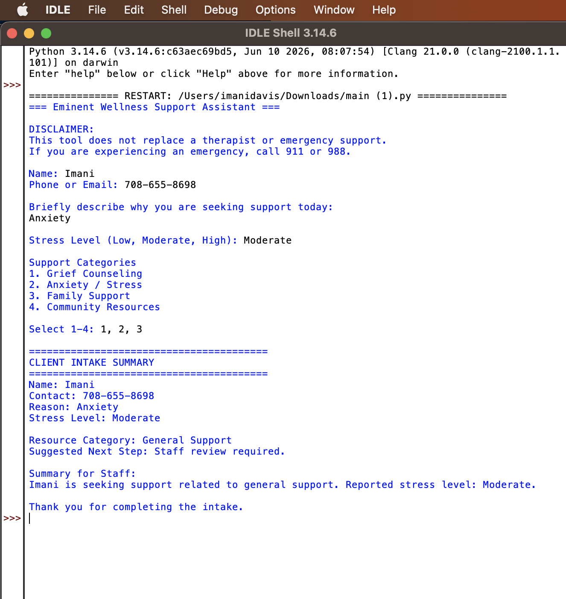

# Eminent Wellness Support Assistant
## Demo

## Overview

The Eminent Wellness Support Assistant is a Python-based intake tool designed for counseling, wellness, and community support organizations.

The tool helps staff:

* Collect client intake information
* Identify support needs
* Organize information for staff review
* Recommend appropriate next steps
* Provide wellness-focused guidance
* Display important safety disclaimers

---

## Why I Built This

I created this project based on my volunteer experience with Eminent Group Consultants PLLC, a wellness-focused organization that promotes resilience, mental wellness, and community support.

The goal was to explore how AI-inspired workflows and simple technology tools can help organizations better understand participant needs and improve intake processes.

---

## Features

* Wellness intake questionnaire
* Support category identification
* Resource recommendations
* Staff summary generation
* Mental health safety disclaimer
* Beginner-friendly Python code

---

## Example Use Case

### User Input

"I'm feeling overwhelmed and stressed after losing my job."

### Program Output

**Support Category**

* Stress Management
* Employment Support

**Suggested Next Steps**

* Connect with counseling resources
* Explore employment assistance programs
* Develop a personal wellness plan

**Staff Summary**

* Participant reports stress related to unemployment and may benefit from wellness and employment support services.

---

## Technologies Used

* Python
* GitHub
* Prompt Engineering
* AI-Assisted Development
* Problem Solving

---

## Skills Demonstrated

* Community Resource Navigation
* Program Development
* Process Design
* User Intake Workflows
* Public Service Technology

---

## Project Screenshots

### Program Demo

Upload your program screenshot here.

### Claude Workflow

Upload your Claude prompt and response screenshots here.

---

## Future Improvements

* Expanded resource categories
* Local resource database integration
* Exportable staff summaries
* AI-powered intake recommendations
